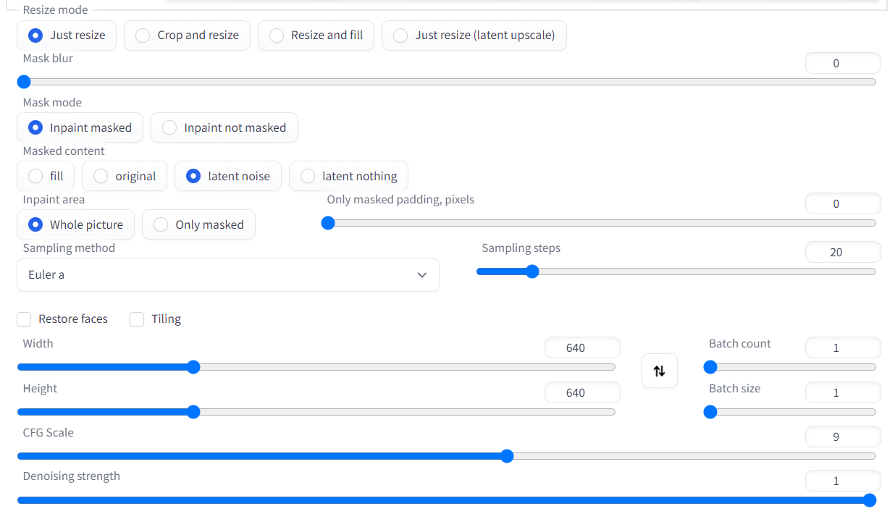

# Infinite Zoom

## What is this?

This is an extension for [AUTOMATIC1111/stable-diffusion-webui](https://github.com/AUTOMATIC1111/stable-diffusion-webui) which can generate infinite loop videos in minutes.  
What it does is repeatedly transformed through outpainting, transitioning from the previous version to the newly created one.

## How to use it?

### Step 1

To prepare an initial image, you can either generate one using txt2img or find one on the internet. Just ensure that its aspect ratio is 1:1.

### Step 2

Send the image to `img2img/inpaint` and ensure that it has the same width and height. You can refer to my parameters listed below.  
Prompt is needed, you may use the same prompt as in txt2img if you prefer.

From the `Script` dropdown menu, select `Infinite Zoom` and leave it as default if you don't understand what it does.

### Notes

1. You may want to use inpaint model `sd-v1-5-inpainting.ckpt` etc.
2. To achieve optimal results, set the `Mask Width (mask_width < image_width / 2)` to 1/4 of the image width. For example, if your image is 1024x1024 pixels, try setting the mask width to 256 pixels.

## Credits

I'm just porting it to AUTOMATIC1111.  
All credit goes to the original creator https://github.com/BalintKomjati/smooth-infinite-zoom.
